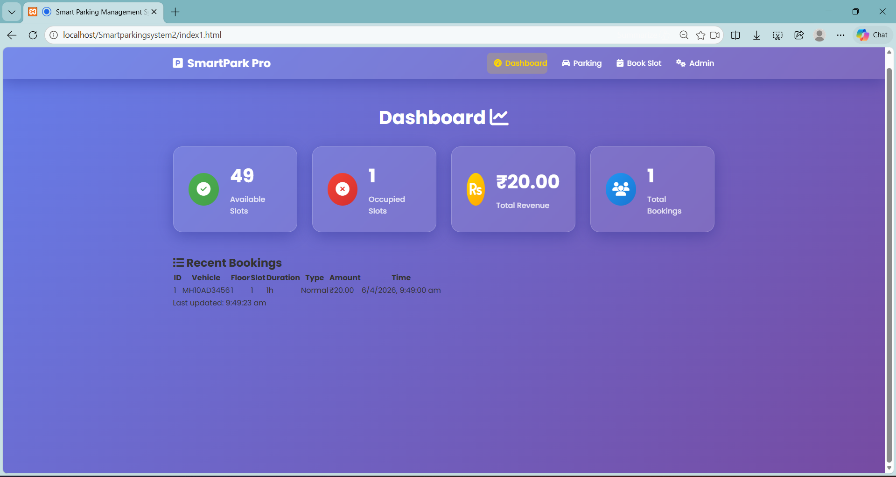

#  Smart Parking Management System

<p align="center">
  
</p>

<p align="center">
  <strong>A Full-Stack Web Application for Smart Parking Slot Reservation and Management</strong>
</p>

<p align="center">
  Built with HTML • CSS • JavaScript • PHP • MySQL
</p>

---

## 📖 About The Project

The **Smart Parking Management System** is a full-stack web application developed to simplify the process of booking and managing parking spaces. The system enables users to reserve parking slots, generate QR codes for secure entry, and monitor parking availability through an intuitive dashboard.

This project was developed as an academic mini project while learning frontend development, backend development, database management, and full-stack web application development.

The primary goal of this project is to reduce the time required to search for parking spaces while providing a simple, responsive, and user-friendly interface.

---

#  Features

###  User Features

- Search available parking slots
- Book parking slots online
- Select parking duration
- View booking confirmation
- QR Code generation for parking entry
- Responsive user interface
- Dynamic parking status

---

###  Admin Features

- Manage parking slots
- View booking records
- Monitor occupied and available spaces
- Database connectivity
- Dashboard for parking management

---

###  System Features

- Responsive Web Design
- Clean UI/UX
- Real-time booking updates
- Dynamic price calculation
- MySQL Database Integration
- PHP Backend Processing
- QR Code Integration
- Booking Dashboard

---

#  Tech Stack

## Frontend

- HTML5
- CSS3
- JavaScript

## Backend

- PHP

## Database

- MySQL

## Development Tools

- XAMPP
- phpMyAdmin
- Visual Studio Code
- Git
- GitHub

---

# ⚙️ Installation Guide

## 1️⃣ Clone Repository

```bash
git clone https://github.com/yourusername/smart-parking-management-system.git
```

---

## 2️⃣ Move Project

Copy the project folder to

```
xampp/htdocs/
```

---

## 3️⃣ Start XAMPP

Start

- Apache
- MySQL

---

## 4️⃣ Create Database

Open

```
http://localhost/phpmyadmin
```

Create a database named

```
parking_management
```

---

## 5️⃣ Import Database

Import

```
parking.sql
```

located inside

```
database/
```

---

## 6️⃣ Run Project

Open your browser

```
http://localhost/smartparkingsystem/index.html
```

---

#  Database

The project uses **MySQL** to store:

- Parking Slots
- Booking Information
- User Details
- Booking Status
- Entry Time
- Exit Time
- Parking Charges

---

#  Future Enhancements

Some planned improvements include:

- User Authentication
- Admin Login
- Online Payment Gateway
- Email Notifications
- SMS Alerts
- Google Maps Integration
- AI-based Parking Prediction
- Vehicle Number Recognition
- Mobile Application
- Analytics Dashboard

---

#  Learning Outcomes

During the development of this project, I gained hands-on experience in:

- Full Stack Web Development
- Responsive Web Design
- Frontend Development
- Backend Development
- PHP Programming
- JavaScript DOM Manipulation
- CRUD Operations
- Database Design
- SQL Queries
- MySQL Integration
- Project Structure
- Git & GitHub
- Debugging
- Problem Solving

---

#  Challenges Faced

Throughout this project, I encountered several challenges such as:

- Connecting PHP with MySQL
- Managing booking records
- Implementing CRUD operations
- Handling dynamic data
- Designing responsive layouts
- Debugging SQL queries
- Organizing project structure
- Integrating frontend with backend

These challenges helped improve my practical development and debugging skills.

---

# 📈 Project Highlights

✅ Responsive Design

✅ User-Friendly Interface

✅ Full Stack Development

✅ Database Connectivity

✅ Dynamic Booking System

✅ QR Code Generation

✅ Dashboard Management

✅ Clean Code Structure

---

# 👩‍💻 Author

## Sanika D

**Computer Engineering Student**

🌱 Aspiring Full Stack Developer

💻 Passionate about Full Stack Development, Problem Solving, and Building Real-World Applications

### Connect with Me

- 💻 GitHub: https://github.com/sanikad7499

---

# ⭐ Show Your Support

If you found this project useful, please consider giving it a **⭐ Star** on GitHub.

It motivates me to build more real-world projects and continue learning.


